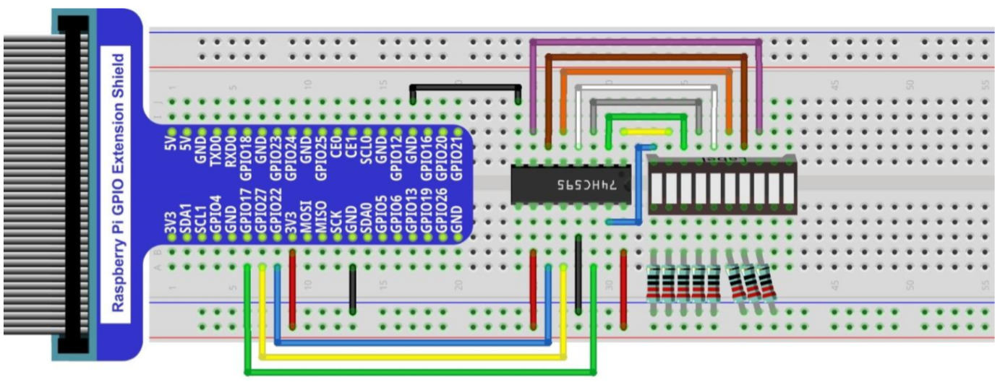

# Avalonia UI loves IoT
This sample shows how to control a LED bar using your Raspberry Pi's GPIO port.

# Requirements
- Raspberry Pi running Rasbpian Linux
- .NET Core 3.0 installed. Instructions [here](https://github.com/dotnet/core/blob/master/samples/RaspberryPiInstructions.md)
## Electronic components used for the sample
  - LED Bar
  - 74HC595
  - Resistor 220Ω (x8)
  - Cables for connections
  - Breadboard
  - GPIO extension shield *(optional)*

## Getting the components
I have used the components from a very nice starter kit by [Freenove](http://freenove.com). You can buy the kits [here](http://freenove.com/store.html). 
Personally, I used the **Super Starter Kit**. The documentation and tutorials are very good, it's cheap and contains lots of components.
# Diagram

# Running the application
After you've connected every component as shown in the diagram, deploy your application to the Raspberry Pi and run the LedBarTest executable file. 

  - You can use SSH Deployer to do it. Get it [here](https://github.com/SuperJMN/DotNet-Ssh-Deployer). It provides a convenient way to deploy.
  - Or you can follow these steps [here](https://github.com/dotnet/iot/blob/master/Documentation/How-to-Deploy-an-IoT-App.md).
